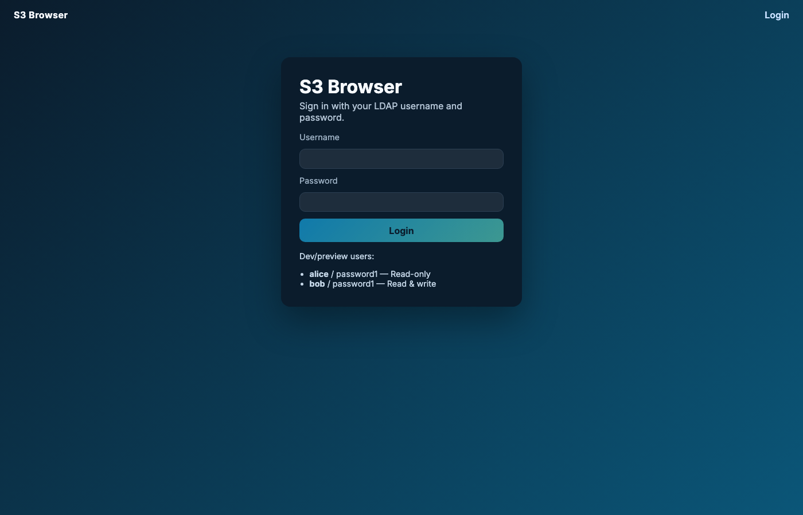
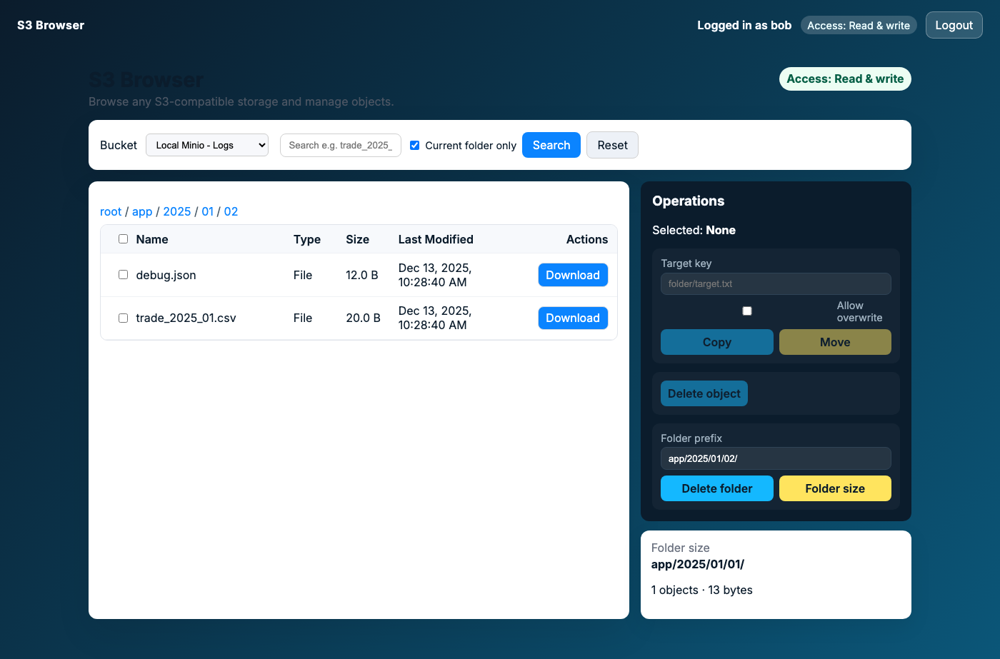

# S3 Browser Webapp

Web UI and Spring Boot API for browsing and managing objects on any S3-compatible storage (MinIO, Ceph, AWS S3, etc.). Ships with a MinIO + embedded LDAP demo, ready-to-run scripts, and Playwright regression tests.

Docs: [Feature guide](docs/features.md) · [Backend architecture](docs/backend-architecture.md)

## Stack & ports
| Layer | Tech | Ports |
| --- | --- | --- |
| Backend | Java 17 · Spring Boot 3.2 | 9080 |
| Frontend | Angular 17 (dev server) | 9071 |
| Storage | MinIO (S3 API / console) | 9070 / 9072 |
| Build | Maven + Angular CLI | — |

## Highlights
- Multi-bucket browser for any S3-compatible endpoint with folder-style navigation and breadcrumbs.
- Wildcard search, sort, pagination, and downloads for large listings.
- Role-aware UI (read-only vs read-write) backed by LDAP; backend enforces authorization.
- Copy/move/delete for single items and bulk selections; recursive folder delete/move; async folder-size jobs streamed via WebSocket.
- Dockerfile + compose profile, seeded demo data, and Playwright end-to-end coverage.

## Screenshots




## Quick start (one-command demo)
Requires Java 17+, Maven 3.9+, Node 18+ (Angular CLI), and Docker.
```
./scripts/demo.sh
```
- Builds frontend, packages the backend, starts MinIO + backend via docker compose, seeds sample buckets.
- App URL: http://localhost:9080
- Login: `alice` / `password1` (read-only) or `bob` / `password1` (read-write)

Stop everything with:
```
./scripts/stop-infra.sh
```

## Developer workflow
1) Start storage + backend container (or bring up full compose):
```
./scripts/start-infra.sh   # MinIO on 9070/9072, backend on 9080
# or: COMPOSE_PROJECT_NAME=s3webapp docker compose up -d --build
```
2) Seed sample data (idempotent):
```
./scripts/seed-data.sh
```
3) Run the backend locally with auto-restart:
```
cd backend
mvn spring-boot:run
```
4) Run the Angular dev server with live reload (CORS already open):
```
cd frontend
npm install
npm start   # http://localhost:9071
```
For a production build served by the backend: `npm run build:prod && cp -r dist/frontend/* ../backend/src/main/resources/static/`.

### Docker compose (production-like)
```
docker compose up -d --build
```
- MinIO: http://localhost:9070 (console http://localhost:9072)
- Backend + served UI: http://localhost:9080
Uses `application-docker.yaml`, which points S3 endpoints at the MinIO container.

## Configuration
### S3 buckets (application.yaml)
```
s3:
  buckets:
    - id: logs
      name: "Local Minio - Logs"
      bucketName: "logs"
      endpointUrl: "http://localhost:9070"
      accessKey: "minioadmin"
      secretKey: "minioadmin"
      region: "us-east-1"
      pathStyleAccess: true
```
Add more entries as needed; set `pathStyleAccess` to true for MinIO.

### LDAP / access control
```yaml
security:
  ldap:
    url: "ldap://ldap.example.com:389"
    base-dn: "DC=example,DC=com"
    bind-dn: "CN=ldap-reader,OU=ServiceAccounts,DC=example,DC=com"
    bind-password: "changeMe"
    user-search-base: "OU=Users,DC=example,DC=com"
    user-search-filter: "(sAMAccountName={0})"
    read-only-groups:
      - "CN=S3_ReadOnly,OU=Groups,DC=example,DC=com"
    read-write-groups:
      - "CN=S3_ReadWrite,OU=Groups,DC=example,DC=com"
    read-only-users: []
    read-write-users: []
    ignore-ssl-validation: true   # dev/non-prod only
    no-role-policy: DENY          # reject auth if no role matches
    embedded:
      enabled: true               # starts in-memory LDAP for dev/e2e
      port: 1389
      seed-ldif: "classpath:ldap/seed.ldif"
```
Authentication uses a service account to find the user DN (`sAMAccountName`) and then binds as the user to validate the password. Roles are derived from group DNs or explicit usernames; if both read-only and read-write match, read-write wins.

### Folder size job tuning
`app.folder-size` controls the async size worker:
- `max-parallel-jobs` (executor pool size per instance)
- `progress-page-interval` (pages listed between progress events)
- `max-objects` and `max-runtime` (set to `0`/`0s` to disable caps)
- `retention` (how long completed jobs stay in memory)
- `cancel-on-disconnect` (cancel a job when the last WebSocket subscriber drops)

## Project layout
```
backend/   # Spring Boot API
frontend/  # Angular client
scripts/   # helper scripts (infra, seed, demo, e2e)
e2e/       # Playwright end-to-end tests + screenshot helper
docs/      # architecture + feature guides (screenshots here)
Dockerfile
docker-compose.yml
```

## Scripts & testing
- `scripts/demo.sh` – build everything, start compose, seed data (one-command demo)
- `scripts/start-infra.sh` / `scripts/stop-infra.sh` / `scripts/stop-app.sh` – manage compose stack
- `scripts/seed-data.sh` – idempotent MinIO seeding (buckets `logs`, `backups`)
- `scripts/e2e.sh` – build stack, seed data, run Playwright suite headlessly
- `e2e/capture-screenshots.js` – regenerate README screenshots (`node e2e/capture-screenshots.js`)

Testing:
- Backend unit/integration: `mvn -f backend/pom.xml test`
- Frontend unit tests: `cd frontend && npm test` (Chrome/Chromium) — build sanity check via `npm run build`
- End-to-end: `./scripts/e2e.sh` (builds images, seeds MinIO + embedded LDAP, runs Playwright against live stack)

## Seeded data to try
Bucket `logs`:
- `app/2025/01/01/app.log`
- `app/2025/01/02/debug.json`
- `app/2025/01/02/trade_2025_01.csv`
- `readme.txt` at root

Bucket `backups`:
- `db/2025/01/01/dump.bin` (random bytes)
- `files/config.json`
- `orphan.bin` at root

These cover deep folders, mixed file types, wildcard search (`trade_2025_*.csv`), and copy/move/delete flows.

## REST API (at a glance)
- `GET /api/buckets` – configured buckets
- `GET /api/buckets/{id}/objects?prefix=&pageToken=` – list folders/files (virtual folders by prefix, pagination)
- `GET /api/buckets/{id}/search?query=trade_2025_*.csv&prefix=app/2025/` – wildcard search (prefix optional)
- `GET /api/buckets/{id}/objects/download?key=...` – download
- `POST /api/buckets/{id}/objects/copy|move` – body `{sourceKey,targetKey,overwrite}`
- `DELETE /api/buckets/{id}/objects` – body `{keys:[...]}`
- `DELETE /api/buckets/{id}/folders` – body `{prefix:".../"}` (recursive delete)
- `POST /api/buckets/{id}/folders/size` – start async folder-size job `{prefix}`; returns job + `websocketPath`
- `GET /api/buckets/{id}/folders/size/{jobId}` – job status snapshot
- `DELETE /api/buckets/{id}/folders/size/{jobId}` – cancel a running size job
- `WS /api/ws/folder-size/{jobId}` – live progress events (STARTED/PROGRESS/PARTIAL/COMPLETED/FAILED/CANCELED)

## Notes
- Search is a simple wildcard match over listed keys (case-insensitive). For large buckets it performs paged listings client-side; tighten prefixes for performance.
- Ports stay within the 9070–9080 range to avoid conflicts.
