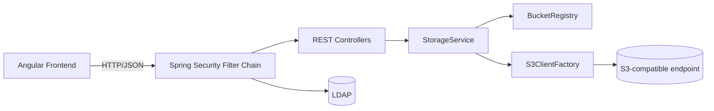

# Backend Architecture

## Overview
- **Purpose:** Provide a REST API for browsing and managing objects on any S3-compatible storage (MinIO, Ceph, AWS S3, etc.), powering the Angular frontend.
- **Tech stack:** Spring Boot 3 (Java 17), AWS SDK v2 S3 client (custom endpoint + path-style support), Maven build, configuration via `application.yaml` with `@ConfigurationProperties`.

## High-level architecture


### Layers
- **Controller layer (`controller`)**: HTTP endpoints for buckets, listing, search, downloads, copy/move/delete, bulk ops, folder size.
- **Service layer (`s3.StorageService`)**: Orchestrates S3 calls, pagination, prefix normalization, conflict handling, aggregation.
- **Configuration (`config`)**: Binds `s3.buckets` entries, exposes CORS settings.
- **Model/DTOs (`model`)**: Request/response payloads for REST contracts.
- **Utility (`util`)**: Helpers for key/prefix manipulation (`KeyUtils`).

## Packages & key classes
- `config`
  - **S3Properties**: `@ConfigurationProperties` binding for `s3.buckets` entries (`id`, `name`, `bucketName`, `endpointUrl`, `accessKey`, `secretKey`, `region`, `pathStyleAccess`).
  - **BucketRegistry**: In-memory lookup of configured buckets by id.
  - **S3ClientFactory**: Builds AWS SDK `S3Client` per bucket (endpoint override, credentials, region, optional path-style).
  - **CorsConfig**: Enables CORS for dev origins (9071, 9080 by default).
- `controller`
  - **BucketController**: `GET /api/buckets`.
  - **ObjectController**: List/search/download; single copy/move; bulk copy/move; bulk delete; folder delete/size; folder copy/move.
- `s3`
  - **StorageService**: Core orchestration of list/search/download/copy/move/delete/bulk operations and folder size aggregation.
- `model`
  - DTOs such as `BucketDto`, `ObjectListResponse`, `ObjectItem`, `FolderItem`, `FolderSizeResponse`.
  - Operation DTOs: `CopyMoveRequest`, `BulkCopyMoveRequest`, `BulkCopyMoveItem`, `BulkOperationResult`, `DeleteObjectsRequest` (keys + prefixes), `DeleteFolderRequest`, `FolderCopyRequest`, `FolderOperationResult`.
- `util`
  - **KeyUtils**: Prefix normalization (`normalizePrefix`), folder-name extraction (`folderNameFromPrefix`), regex translation for wildcard search (`wildcardToRegex`), name extraction.

## Class responsibilities & interactions
- **S3Properties / BucketRegistry**
  - Load bucket configs from YAML once at startup; `BucketRegistry.require(id)` throws if unknown id.
- **S3ClientFactory**
  - Builds and caches `S3Client` instances configured with endpoint override, credentials, region, and optional path-style access for MinIO-like stores.
- **StorageService**
  - **List/Search**: Uses `ListObjectsV2` with delimiter `/`, normalizes prefixes, builds `FolderItem` list from `commonPrefixes`, maps `S3Object` to `ObjectItem` (with HEAD to capture content type).
  - **Download**: Streams object by key with error mapping to 404.
  - **Single copy/move**: Copy then optional delete; conflict check on overwrite=false.
  - **Bulk copy/move**: Accepts array of `{sourceKey,targetKey}` items; processes independently, continues on failures, returns per-item `BulkOperationResult`.
  - **Delete**: Accepts direct keys and/or prefixes; prefixes are expanded to all matching keys before issuing batched S3 delete (900 keys per chunk).
  - **Folder delete**: Lists all keys under prefix then reuses delete logic.
  - **Folder copy/move**: Lists all objects under `sourcePrefix`, builds relative path, writes to `targetPrefix`, respects overwrite=false by skipping conflicts and recording an error per object, optionally deletes source per object when `deleteSource=true`. Returns `FolderOperationResult` with copied/skipped/error counts (partial success tolerated).
  - **Folder size**: Iterates all objects under prefix, summing sizes and counts.
  - **Search**: Client-side wildcard match (case-insensitive) against keys and names within a prefix; paginates through listings.
- **Controllers**
  - Map REST routes to `StorageService`, validate payloads, and wrap responses (including bulk/folder operations).

## Security & LDAP
- **Authentication flow**
  - Credentials posted to `/api/auth/login`.
  - `LdapUserService` binds with a service account (`security.ldap.bind-dn` / `bind-password`) to search for the user DN using `sAMAccountName` under `user-search-base`.
  - After locating the DN, it binds as the end user with the submitted password to verify credentials.
  - `memberOf` values are read to derive app roles; SSL validation can be skipped in non-prod via `security.ldap.ignore-ssl-validation`.
- **Authorization model**
  - Roles: `ROLE_READ_ONLY` and `ROLE_READ_WRITE`.
  - Role sources (union, read-write wins):
    - Group DNs listed in `security.ldap.read-write-groups` / `read-only-groups` matched against `memberOf`.
    - Usernames in `security.ldap.read-write-users` / `read-only-users`.
  - `security.ldap.no-role-policy` defaults to `DENY` (authentication is rejected if no role matches).
- **Spring Security wiring**
  - `SecurityConfig` defines the filter chain, CORS, and an `AuthenticationProvider` backed by `LdapUserService`.
  - Session-based auth (JSESSIONID). `AuthController` exposes `/api/auth/login`, `/api/auth/me`, `/api/auth/logout`.
  - All `/api/**` endpoints require authentication; write operations (`POST/DELETE` object + folder ops) require `ROLE_READ_WRITE`. Read-only users may list, search, download, and compute folder size.
  - Static frontend routes are publicly served; API calls enforce authorization even if the UI is bypassed.
- **Dev/test LDAP**
  - `EmbeddedLdapConfig` can start an in-memory server when `security.ldap.embedded.enabled=true` (default in `application.yaml` and `application-docker.yaml`).
  - Seed LDIF (`classpath:ldap/seed.ldif`) provides users `alice` (read-only group), `bob` (read-write), `both` (both groups), `carol` (username override to read-write), and `guest` (no role) plus the service account `ldap-reader`.

## Request flows

### Listing objects (prefix view)
```
Frontend -> GET /api/buckets/{id}/objects?prefix=p -> ObjectController -> StorageService
  StorageService:
    - normalize prefix
    - listObjectsV2(prefix, delimiter="/")
    - map commonPrefixes -> FolderItem
    - map contents -> ObjectItem (HEAD for content type)
<- ObjectListResponse (currentPrefix, folders, objects, nextPageToken)
```

### Folder move (prefix to prefix)
```
Frontend -> POST /api/buckets/{id}/folders/move {sourcePrefix, targetPrefix, overwrite}
ObjectController -> StorageService.handleFolderOperation(deleteSource=true)
  - normalize prefixes
  - list all keys under sourcePrefix
  - for each key:
      relative = key.removePrefix(sourcePrefix)
      targetKey = targetPrefix + relative
      if overwrite=false && target exists: record error, skip
      else copyObject; if deleteSource: deleteObject(sourceKey)
  - return FolderOperationResult {total, copied, skipped, errors[]}
<- JSON result shown in UI
```

### Folder size
```
Frontend -> GET /api/buckets/{id}/folders/size?prefix=foo/bar/
ObjectController -> StorageService.folderSize
  - list all objects under prefix (paged)
  - sum sizes and count objects
<- {prefix,totalSizeBytes,objectCount}
```

## Error handling & logging
- S3 missing key -> `NoSuchKeyException` mapped to 404 via `ResponseStatusException`.
- Bulk/folder operations never abort on first failure; per-item errors are captured in `BulkOperationResult.errors`.
- Standard Spring error responses are returned for bad input (e.g., empty delete request).
- Logging: Spring Boot defaults plus AWS SDK logging; S3 mock/integration tests log to console. Access keys are never logged.

## Configuration & environments
- `application.yaml` (local dev) and `application-docker.yaml` (docker-compose) declare buckets and CORS origins.
- Important properties: `server.port` (default 9080), `app.cors.allowed-origins`, `s3.buckets[...]` entries as shown in README.
- Profiles: `docker` profile used by compose via `SPRING_PROFILES_ACTIVE=docker`.

## Extensibility
- **Add a bucket:** Add another entry under `s3.buckets` with new `id`, `bucketName`, endpoint/credentials; restart the backend.
- **Add new operations:** Extend `StorageService` with new methods and expose through `ObjectController`; reuse `S3ClientFactory` for client creation.
- **Add auth:** Wrap controllers with Spring Security (JWT/basic/OPA), secure endpoints, and inject security context into service if needed. CORS origins can be tightened in `application.yaml`.

## Notes on overwrite semantics
- Bulk copy/move and folder copy/move honor `overwrite=false` by skipping conflicting targets, recording an error per item, and continuing the operation. This avoids partial completion failures while surfacing conflicts to the caller.
